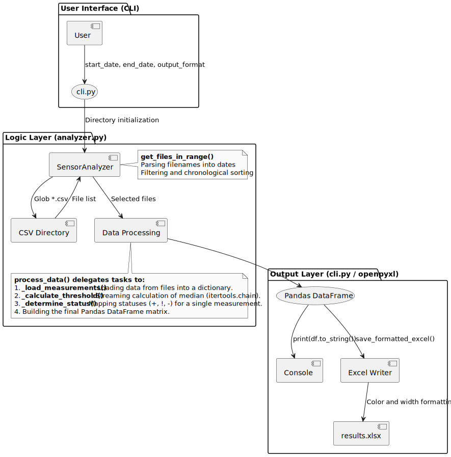

#+TITLE: Sensor Analyzer Project - Data Flow
#+AUTHOR: Michał Janiga

* Data flow in the project

The diagram below shows the data path from user input parameters to the final report.

#+begin_src plantuml :file data_flow.svg
@startuml
skinparam monochrome true
skinparam shadowing false

package "User Interface (CLI)" {
    [User] --> (cli.py) : start_date, end_date, output_format
}

package "Logic Layer (analyzer.py)" {
    (cli.py) --> [SensorAnalyzer] : Directory initialization
    [SensorAnalyzer] --> [CSV Directory] : Glob *.csv
    [CSV Directory] --> [SensorAnalyzer] : File list
    
    note right of [SensorAnalyzer]
        **get_files_in_range()**
        Parsing filenames into dates
        Filtering and chronological sorting
    end note

    [SensorAnalyzer] --> [Data Processing] : Selected files
    
    note bottom of [Data Processing]
        **process_data() delegates tasks to:**
        1. **_load_measurements()**: Loading data from files into a dictionary.
        2. **_calculate_threshold()**: Streaming calculation of median (itertools.chain).
        3. **_determine_status()**: Mapping statuses (+, !, -) for a single measurement.
        4. Building the final Pandas DataFrame matrix.
    end note
}

package "Output Layer (cli.py / openpyxl)" {
    [Data Processing] --> (Pandas DataFrame)
    (Pandas DataFrame) --> [Console] : print(df.to_string())
    (Pandas DataFrame) --> [Excel Writer] : save_formatted_excel()
    
    [Excel Writer] --> [results.xlsx] : Color and width formatting
}
@enduml
#+end_src

#+RESULTS:

** Stage descriptions:
1. **Argument retrieval**: The =cli.py= script validates the dates entered by the user.
2. **File selection**: =SensorAnalyzer= searches the data folder, extracts dates from filenames (e.g., =16.10.2021.csv=), and sorts them so the report columns are in the correct order.
3. **Statistical analysis**: The system loads data (=_load_measurements=) and, using memory optimization (=itertools.chain=), passes times as a stream to the function determining the median (=_calculate_threshold=).
4. **Transformation**: Data is evaluated using the =_determine_status= method and flattened into a matrix where rows are sensors and columns are dates.
5. **Presentation**: The result is sent to the screen or an Excel file with automatic cell coloring (Green for +, Red for !, Grey for -).
